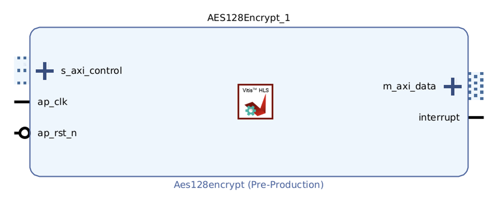

# SCA Hardware design examples repository

This repository contains examples of cryptographic hardware designs mainly for side-channel attack research.
Each example can be implemented on ChipWhisperer CW305 FPGA and SAKURA-X FPGA using our FPGA shell.
For block design examples for each board, please refer to each shell repository: [CW305](https://github.com/hal-lab-u-tokyo/cw305-shell) and [SAKURA-X](https://github.com/hal-lab-u-tokyo/sakura-x-shell/).

# Verified boards/tools
* Vivado/Vitis 2023.2
* ChipWhisperer CW305 board
* Kintex-7 FPGA on SAKURA-X board
* ZCU-104 Evaluation Kit

## Note
Different versions of Vivado/Vitis may generate different address maps for register interfaces.
Please check the address map in the generated IP core.

# List of examples
* aes128_hls: Vitis HLS implementation of AES-128 encryption
* aes128_rsm_hls: Vitis HLS implementation of AES-128 encryption with RSM masking scheme
* aist_aes_core: A wrapper module for the AES-128 encryption core developed by AIST
* googlevault_aes_core: A wrapper module for the AES encryption core released for Google ProjectVault, supporting AES-128, AES-192, and AES-256 encryption.
* aes128_rsm_rtl: RTL implementation of AES-128 encryption with the RSM masking scheme

Some files are copyrighted and licensed by the original authors.
Please see [LICENSE-3RD-PARTY](LICENSE-3RD-PARTY) for details.

## aes128_hls

To create an IP core from the HLS code, go to [aes128_hls](./aes128_hls) and run the following command:

```
vitis_hls -f create_ip.tcl target_board=<board_name> [target-freq=<frequency>] [target-part=<part_name>]
```

`target_board` argument is mandatory and `cw305` or `sakura-x` can be specified.
Then, the HLS project will be created in the hls_<board_name>_aes_enc.
The other arguments are optional.
If you want to specify the target frequency, you can set `target-freq` argument. The default value is 50 MHz.
If you want to specify the target FPGA part other than the supported boards, you can set `target-part` argument.

As shown in the following figure, the IP core has an AXI4-Lite slave port to control the encryption process and an AXI4 master port to read/write data including key, plaintext, and ciphertext.
Therefore, AXI4 accessible registers or block memory is needed for key, plaintext, and ciphertext.



The HLS IP core has AXI4 Lite slave interface to control the encryption process and set memory addresses of key, plaintext, and ciphertext.
See [AMD UG1399](https://docs.amd.com/r/2023.2-English/ug1399-vitis-hls) for more details about the control and status registers.

Address offset for each control register is as follows:

- 0x00 : Control signals
    -   bit 0  - ap_start (Read/Write/COH)
    -   bit 1  - ap_done (Read)
    -   bit 2  - ap_idle (Read)
    -   bit 3  - ap_ready (Read/COR)
    -   bit 4  - ap_continue (Read/Write/SC)
    -   bit 7  - auto_restart (Read/Write)
    -   bit 9  - interrupt (Read)
    -   others - reserved
- 0x10 : address of key
- 0x18 : address of plaintext
- 0x20 : address of ciphertext

(SC = Self Clear, COR = Clear on Read, TOW = Toggle on Write, COH = Clear on Handshake)

## aes128_rsm_hls

An HLS design with a masking scheme, RSM ([Maxime Nassar, et. al, DATE 2012](https://doi.org/10.1109/DATE.2012.6176671)).

Makefile is provided to create an IP core from the HLS code.
After going to aes128_rsm_hls directory, run the following command:

```
make TARGET_BOARD=<board_name> [TARGET_FREQ=<frequency>] [SEED=<seed>]
```

The `TARGET_BOARD` argument is mandatory and `cw305` or `sakura-x` can be specified.
Then, the HLS project will be created in the hls_<board_name>_aes_enc.

This repository does not include mask tables.
Instead, the mask values are generated by the provided Python script.
`SEED` argument is optional and can be used to set the seed value of random number generation for the mask values.

The control interface is the same as the original AES-128 HLS design.
But it has an extra control register `rotate` to set the start rotation value (*j*) for the masking scheme.
That register is usually mapped to the address offset 0x28.

## aist_aes_core

`aist_aes_core_1_0` directory can be added as an IP repository for Vivado.
The IP core has an AXI4-Lite slave port to control the encryption process, send key and plaintext, and receive ciphertext.
The memory-mapped registers are as follows:

|      Address      |     Width   |   Description     |
|:-----------------:|:-----------:|:-----------------:|
| `BASE` + `0x00`   |   128 bit   |  Key (R/W)        |
| `BASE` + `0x10`   |   128 bit   |  Plaintext (R/W)  |
| `BASE` + `0x20`   |   128 bit   |  Ciphertext (R)   |
| `BASE` + `0x30`   |   32 bit    |  Control          |

If `control[1]` bit is set to 1, the key is written to the IP core.
If `control[0]` bit is set to 1, the plain text is written to the IP core and the encryption process is started.

An output port `o_running` is set to 1 while the encryption process is running.
Thus, it can be used for triggering the oscilloscope.

## googlevault_aes_core

`googlevault_aes_core_1_0` directory can be added as an IP repository for Vivado.

The IP core has an AXI4-Lite slave port to control the encryption process, send key and plaintext, and receive ciphertext.
This implementation supports AES-128, AES-192, and AES-256.
Although the original design can decrypt the ciphertext, this IP core disables the decryption function.

The memory-mapped registers are as follows:
|      Address      |     Width   |   Description     |
|:-----------------:|:-----------:|:-----------------:|
| `BASE` + `0x00`   |   256 bit   |  Key (R/W)        |
| `BASE` + `0x20`   |   128 bit   |  Plaintext (R/W)  |
| `BASE` + `0x30`   |   128 bit   |  Ciphertext (R)   |
| `BASE` + `0x40`   |   32 bit    |  Control          |

The control register is formatted as follows:
| 31:4 | 3 | 2:1 | 0 |
|:----:|:-:|:---:|:-:|
| Unused | running (RO) | size (RW) | start (RW) |

* running: 1 if the encryption process is running. It is the same as output signal `o_running`.
* size: 00 for AES-128, 01 for AES-192, and 10 for AES-256.
* start: writing 1 to start the encryption process.

### external trigger
The IP core has an external trigger input port `i_external_trigger`.
CW305 shell has a dedicated channel for triggering the encryption without data access channel.
This trigger channel is assumed to be connected to such a trigger signal.
Please note that an IP parameter `ENABLE_EXTERNAL_TRIGGER` should be set to true to enable this feature.
If this parameter is set to false, the trigger signal is hardwired to low level internally so that there is no need to connect the trigger signal.
This parameter can be set in the IP customization GUI in Vivado block design.

## aes128_rsm_rtl

`aes128_rsm_rtl_1_0` directory can be added as an IP repository for Vivado.
Like the HLS version, this repository does not include mask tables, so that you need to generate mask values by the provided Python script.
In the directory, just run `make` to generate the mask values.

The IP core has an AXI4-Lite slave port.
Its address map is similar to the AIST core wrapper as follows:

|      Address      |     Width   |   Description     |
|:-----------------:|:-----------:|:-----------------:|
| `BASE` + `0x00`   |   128 bit   |  Key (R/W)        |
| `BASE` + `0x10`   |   128 bit   |  Plaintext (R/W)  |
| `BASE` + `0x20`   |   128 bit   |  Ciphertext (R)   |
| `BASE` + `0x30`   |   32 bit    |  Control          |
| `BASE` + `0x34`   |   32 bit    |  Rotate           |

The valid range of the `rotate` register is from 0 to 15.
Like the other IP cores, it has an output port `o_running` to indicate the encryption process is running.


# License

This repository is licensed under MIT License, see [LICENSE](LICENSE) for more information.